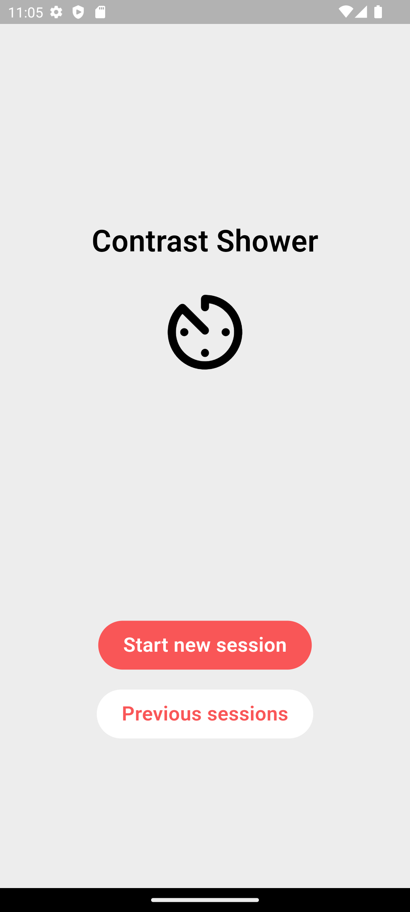
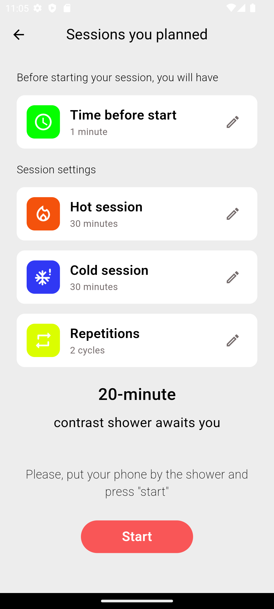
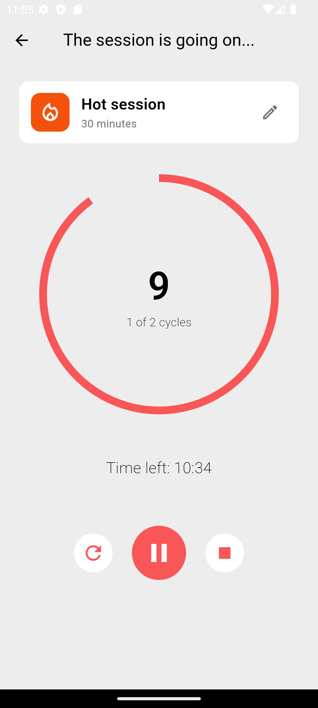
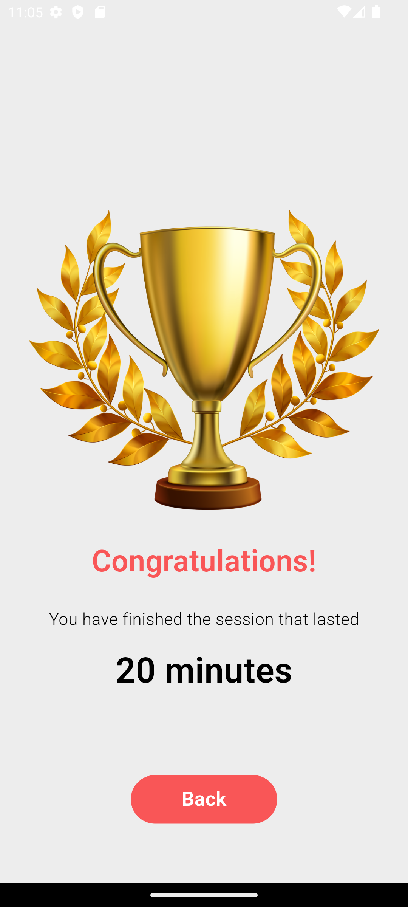

# Contrast Shower

_Read this in other language: [English](README.md), [Русский](README.ru.md)_

## Project Description

The Contrast Shower app is designed for people who practice contrast showers.

Here the user can set the time for a shower with cold/hot water, the time before the start of the session, the number of repetitions and start the timer. The session history will also be available.

❗❗❗The project is under development

## Plans for improvement

- To finish the timer functionality
- Complete data entry and transfer of this data to the timer
- Add the ability to see data from past sessions

## Current status of the project

## Frameworks and technologies used

* Description: Flutter is an open source framework by Google for building beautiful, natively compiled, multi-platform applications from a single codebase.
* Resources:
  * Official Website: [Official Website](https://flutter.dev/)
  * Documentation: [Documentation](https://docs.flutter.dev/)

* Description: Firebase is a set of tools and services for the development of mobile and web applications from Google. With it, you can quickly deploy a backend with your own server logic, connect databases and configure user authorization. The platform is often used to create MVP and develop with limited resources.

* Resources:
  * Official Website: [Official Website](https://firebase.google.com/)
  * Documentation: [Documentation](https://firebase.google.com/docs?hl=ru)